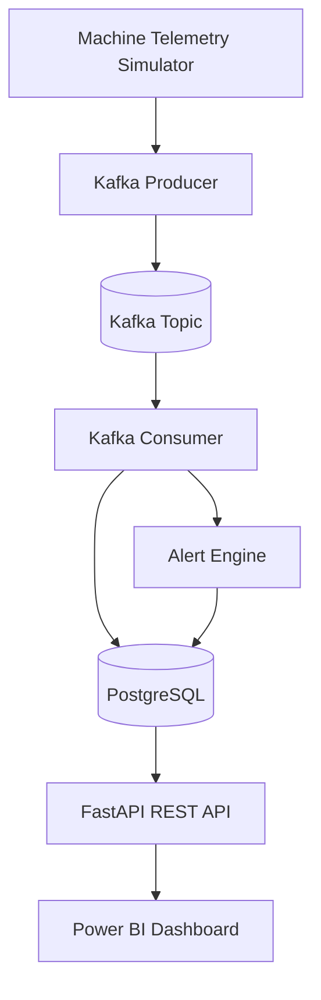
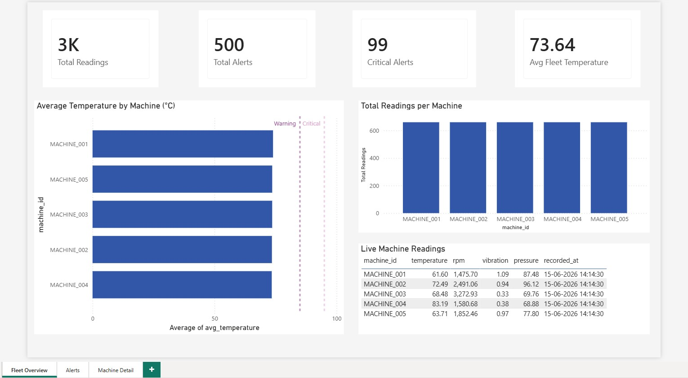
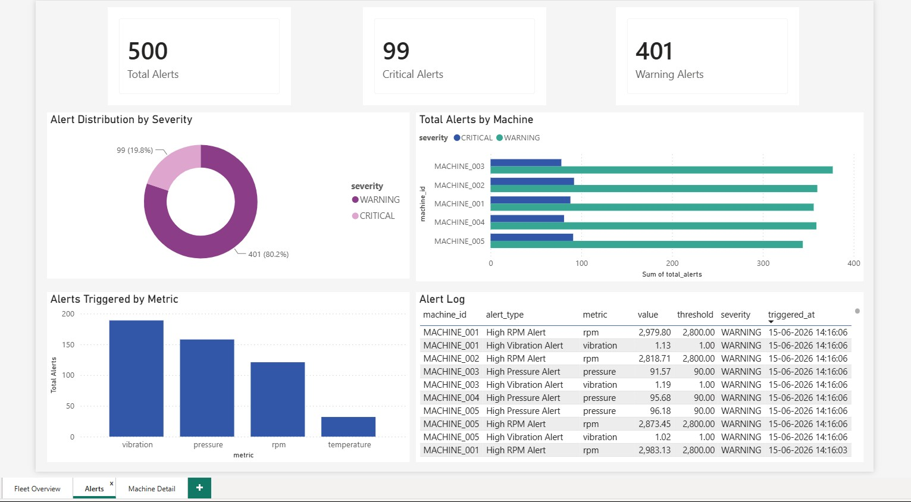
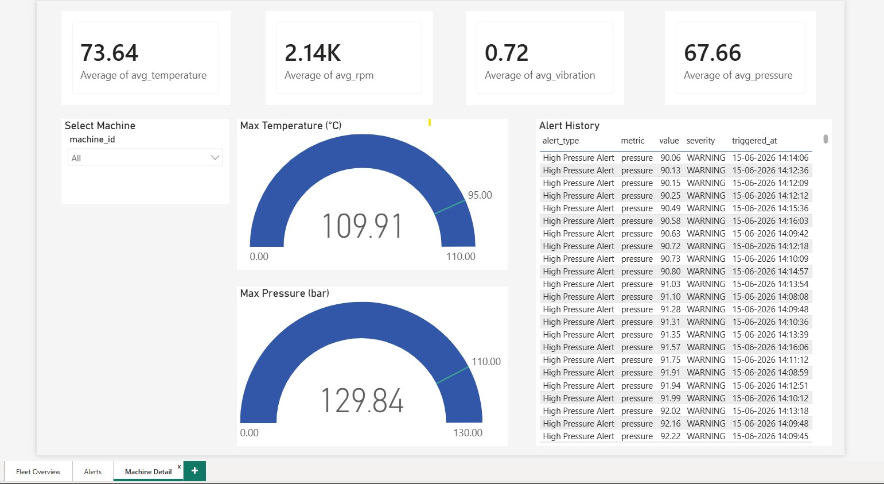

# Real-Time Manufacturing Monitoring System

A production-style real-time data streaming platform that simulates industrial machine telemetry, processes live events through Apache Kafka, stores operational data in PostgreSQL, and delivers monitoring insights through REST APIs and Power BI dashboards.

## Project Highlights

* Built a real-time streaming pipeline using Apache Kafka to process industrial machine telemetry generated every 3 seconds
* Implemented event-driven processing and threshold-based alerting for operational anomaly detection
* Developed 8 REST APIs using FastAPI for live monitoring, machine analytics, and alert management
* Designed a PostgreSQL backend for storing telemetry and alert data
* Created interactive Power BI dashboards for fleet health monitoring and operational insights
* Containerized the complete platform using Docker Compose for reproducible deployment

## Tech Stack

| Category         | Technologies           |
| ---------------- | ---------------------- |
| Programming      | Python 3.11            |
| Streaming        | Apache Kafka           |
| API Development  | FastAPI                |
| Database         | PostgreSQL             |
| Visualization    | Power BI               |
| Containerization | Docker, Docker Compose |

## Architecture



## Dashboard Preview

### Fleet Overview


### Alerts Dashboard


### Machine Detail



## System Components

### Data Generation

* Simulates 5 industrial machines
* Generates temperature, RPM, vibration, and pressure telemetry
* Produces sensor readings every 3 seconds
* Injects anomalies using configurable threshold violations

### Streaming & Processing

* Kafka producer-consumer architecture
* Event-driven processing pipeline
* Real-time anomaly detection
* WARNING and CRITICAL alert classification

### Data Storage

* PostgreSQL persistence layer
* Historical telemetry storage
* Alert management and tracking
* Trend analysis support

### API Layer

* FastAPI-based REST services
* Machine health monitoring
* Alert retrieval and filtering
* Fleet-level analytics and summaries
* Historical trend analysis

### Analytics & Visualization

* Fleet Overview dashboard
* Alert Monitoring dashboard
* Machine Detail dashboard
* Real-time operational insights

## Key Engineering Concepts Demonstrated

### Real-Time Data Streaming

* Event-driven architecture
* Kafka producer-consumer pattern
* Stream processing
* Asynchronous data flow

### Backend Engineering

* REST API development
* Service-oriented architecture
* Data persistence
* Containerized deployment

### Data Engineering

* Streaming data ingestion
* Event processing pipelines
* Data modeling
* Operational analytics

### Monitoring & Alerting

* Threshold-based anomaly detection
* Alert classification and escalation
* Operational monitoring
* System observability

## Business Value

This project demonstrates how real-time industrial telemetry can be transformed into actionable operational insights through streaming data pipelines, automated alerting, and interactive analytics. The architecture mirrors patterns commonly used in manufacturing, IoT, Industry 4.0, and modern event-driven data platforms.

## Quick Start

```bash
docker-compose up -d
```

### Access Services

* FastAPI Documentation → `http://localhost:8000/docs`
* Kafka UI → `http://localhost:8085`
* PostgreSQL → `localhost:5432`

## API Capabilities

* Live machine telemetry monitoring
* Historical sensor data retrieval
* Alert tracking and filtering
* Machine-level performance summaries
* Fleet-wide operational insights
* Time-series trend analysis

## Production-Grade Features

- Real-time event processing using Apache Kafka
- Decoupled producer-consumer architecture
- Threshold-based anomaly detection and alerting
- Persistent storage of telemetry and alert events
- REST APIs for operational monitoring and analytics
- Interactive dashboards for business users
- Containerized deployment using Docker Compose
- Modular and extensible service architecture

The solution showcases how operational data can be collected, processed, stored, and visualized in near real-time to support monitoring and decision-making workflows.
